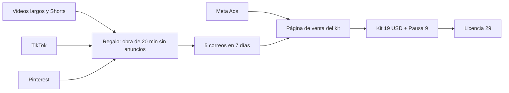

# Plan de facturación de Rin

*Septiembre de 2026. Reemplaza al plan por etapas de `monetizacion.md`: se descartan
las membresías y se pone primero lo que factura antes.*

## En 30 segundos

- **Hay una fecha límite: 31 de enero de 2027.** Desde el 1 de febrero, YouTube pide el
  doble para entrar al Programa de Socios: 8.000 horas de visualización en lugar de 4.000,
  o 20 millones de vistas de Shorts en lugar de 10. Quien ya está dentro antes de esa
  fecha no tiene que cumplir el requisito nuevo. Como la revisión de YouTube tarda hasta
  un mes, la meta real es postularse a mediados de diciembre. Todo el calendario de
  YouTube se ordena para llegar.
- **Lo primero que factura es un producto digital con anuncios de Meta**, a partir de
  la semana 3. No depende de suscriptores ni de horas.
- **La distribución a Spotify y demás tiendas** factura sola desde el segundo o tercer mes,
  con el mismo catálogo.
- **Lo que no va a pagar:** TikTok no paga a creadores de Uruguay, y un directo de TikTok
  con un video en bucle está prohibido. TikTok y Pinterest se usan para llevar gente al
  producto y al canal.
- Todo sigue siendo sin cara y sin voz.

## Las fuentes de ingreso, de la más rápida a la más lenta

| Fuente | Empieza a facturar | Qué necesita | Tu trabajo |
|---|---|---|---|
| **Producto digital + Meta Ads** | Semana 3 | Producto en Payhip, página de venta con dominio propio, cuenta publicitaria | Aprobar textos y presupuesto |
| **Licencia para profesores** (dentro del mismo producto) | Semana 3 | Una casilla más en la página de venta | Ninguno |
| **Streaming** (Spotify, Apple Music, Amazon…) | Mes 2–3 (las tiendas liquidan con 2–3 meses de atraso) | Cuenta en DistroKid, ~USD 25 por año | Crear la cuenta |
| **YouTube: anuncios** | Al entrar al Programa de Socios (meta: antes del 31/01/2027) | 1.000 suscriptores + 4.000 horas | Publicar lo que se monta |
| **YouTube: Super Chat y Super Thanks** | Con 500 suscriptores + 3.000 horas | Directos y videos | Ninguno |

**Por qué este orden.** El dinero de YouTube llega tarde y en cantidades chicas: la
música para dormir se escucha con la pantalla apagada y el pago por mil vistas del nicho
es bajo. Un producto propio cobra desde la primera venta, y cada suscriptor del canal
vale más cuando existe algo que comprarle.

## El producto

### Qué es

**Rin Sleep Kit — 21 Nights** (en inglés, el idioma del canal).
**Kit de sueño Rin — 21 noches** (en español, para Latinoamérica, más barato).

| Contenido | Detalle |
|---|---|
| 7 obras exclusivas para dormir | 60 minutos cada una, descargables (MP3 320 y WAV), sin anuncios, compuestas solo para el kit |
| 7 versiones cortas | 15 minutos, para la siesta o para la cama antes de apagar la luz |
| Guía de 21 noches (PDF) | Una página por noche: qué obra poner, una rutina de 10 minutos, la respiración 4-6 que la música ya marca |
| Tarjeta «Si te despertás a las 3» | Qué hacer y qué obra poner, en una hoja |
| Registro imprimible | 21 casillas para anotar cómo dormiste |

### Qué problema resuelve (y por qué no lo resuelve una IA)

El que busca música para dormir en YouTube tiene un problema concreto: **los anuncios lo
despiertan**, y el celular con pantalla encendida y datos no ayuda. El kit resuelve eso
con algo que una IA no puede dar en una respuesta: **las obras**, sin anuncios, en el
teléfono, sin conexión, y un plan de 21 noches que dice cuál poner cada noche.

El argumento que ningún otro canal puede copiar: **la música respira**. Cada obra lleva el
ciclo respiratorio compuesto adentro, de 6 a 4,5 respiraciones por minuto. La guía
enseña a seguirlo.

### Precios

| Oferta | Inglés (USD) | Español (USD) |
|---|---|---|
| Kit 21 noches | **19** | 9 |
| Agregado en el pago (*order bump*): **Pausa** — 10 obras de 10 minutos para momentos de ansiedad | +9 | +5 |
| Oferta después de la compra: **Licencia para clases** (usar las obras en clases de yoga y meditación y en sus propios videos) | 29 | 15 |

El agregado y la oferta posterior son los que hacen rentables los anuncios: suben el
ticket promedio de 19 a unos 24–26 dólares sin conseguir un cliente más.

**Dónde se cobra: Payhip, con PayPal**, la plataforma que ya usás. No Hotmart: su página
de pago genera desconfianza en el comprador, y ese rechazo en el último clic es la venta
perdida más cara. La venta se hace en **una página propia con dominio de Rin**; Payhip
solo aparece en el paso de pago.

### Lo que el producto nunca dice

La regla de `monetizacion.md` sigue: **se vende música, no salud.** Nada de «cura el
insomnio», «frecuencia que sana» ni «repara el ADN». Además de ser falso, Meta rechaza o
restringe esos anuncios, y el canal perdería credibilidad. Por eso tampoco se hace un
producto de metafísica: cualquier promesa de ese terreno choca con las políticas de
anuncios justo donde más se necesitan.

## El recorrido del cliente

- **El regalo** (imán de correos): una obra de 20 minutos sin anuncios a cambio del
  correo. Va en la descripción de cada video, en el comentario fijado, en la biografía de
  TikTok y en los pines.
- **Los 5 correos**: entrega del regalo, cómo usar la respiración, la historia de cómo se
  compone una obra, el kit, último aviso del precio de lanzamiento. MailerLite es gratis
  hasta 1.000 contactos.
- **La página de venta**: una sola página, con el mandala en movimiento, 3 muestras de
  audio y el precio, en un **dominio propio** (~USD 12 por año). El botón de compra lleva
  al pago de Payhip.

## Meta Ads

### Antes de gastar un dólar

- Cuenta comercial de Meta con una página de Facebook «Rin» y la cuenta de Instagram.
- Píxel y API de conversiones en la página de venta, y dominio verificado.
- Plataforma de cobro conectada a esos eventos (compra, inicio de pago).

### Qué se anuncia

- **Formato:** video vertical de 15–30 segundos, el mandala con el sonido de la obra y una
  frase en pantalla. Es lo que el canal ya produce: cero costo de producción.
- **5 ganchos para probar**, todos hablando del producto y no de la persona:
  - «21 nights of sleep music. No ads. No wifi.»
  - «The ads wake you up at 3 a.m. This doesn't.»
  - «Music that breathes slower, so you do too.»
  - «7 hours of sleep music you own.»
  - «Put it on, lights off, phone face down.»
- **Política de Meta sobre atributos personales:** un anuncio no puede afirmar ni insinuar
  que la persona tiene una condición de salud. «Do you have insomnia?» se rechaza;
  «21 nights of sleep music» no.

### Cuánto y cómo se decide

| Etapa | Presupuesto | Regla |
|---|---|---|
| Prueba | **USD 5–7 por día**, 3 anuncios, 7–10 días | Se apaga el anuncio con CTR menor a 1 % o sin clics en la página de venta tras USD 10 |
| Validación | El mejor, USD 7–10 por día | Se sigue si el costo por venta queda por debajo de USD 15 |
| Escala | +20 % de presupuesto cada 3 días mientras el costo por venta aguante | Se frena si sube dos días seguidos |

**Cómo se lee si funciona.** Con un ticket promedio de 25 dólares y comisiones de la
plataforma de cobro de ~10 %, quedan ~22 por venta. Mientras cada venta cueste menos de
15 en anuncios, la cuenta da positiva. Las primeras dos semanas casi siempre pierden
dinero mientras Meta aprende.

**Con USD 5–7 por día, Meta junta pocas compras por semana** y aprende despacio. Por eso
la campaña empieza optimizando para un evento más frecuente (inicio de pago) y se pasa a
«compra» cuando hay 10–15 ventas. Menos anuncios a la vez (3, no 5) para no repartir un
presupuesto chico entre demasiadas pruebas.

**Público:** amplio, sin intereses, en Estados Unidos, Reino Unido, Canadá y Australia
para el inglés. Para el español, México, Argentina, Colombia, Chile, Uruguay y España.

## El ecosistema

| Plataforma | Para qué | Cómo |
|---|---|---|
| **YouTube** | Suscriptores, horas, confianza | Videos largos a mano (una hora de montaje automático); Shorts automáticos por Make, uno por día |
| **TikTok** | Alcance y regalo | Los mismos 5 Shorts por obra, a mano, con portada y descripción separadas (ya están en la hoja). **Promoción pagada de USD 3–5 por día durante una semana para llegar a 1.000 seguidores** (te funcionó con tu cuenta personal), eligiendo Estados Unidos, Reino Unido, Canadá y Australia: son el público del canal y del kit en inglés. Con 1.000 seguidores se habilita el enlace en la biografía |
| **Pinterest** | Tráfico que dura meses | Pines de video (los Shorts) y pines de imagen (miniaturas) hacia el regalo y el kit. Carga masiva por CSV, como en Tu Catálogo Vende |
| **Instagram** | Base para Meta Ads | Los mismos Shorts como Reels. La cuenta tiene que existir para anunciar |

TikTok no paga a creadores de Uruguay: su programa de recompensas funciona en un grupo
chico de países (Estados Unidos, Reino Unido, Alemania, Francia, Japón, Corea, Brasil y
México, entre otros) y exige estar físicamente en ellos. Se usa para llevar gente.

## Directos

### YouTube: sí, de a poco

- **Desde ya, gratis: estrenos.** Cada video largo se publica como *Estreno* a una hora
  fija. Funciona como un directo corto: aparece en suscripciones, junta gente a la misma
  hora y habilita el chat. No necesita nada técnico.
- **Directo 24 horas «Rin · sleep music live»**, cuando el canal tenga 8–10 obras
  publicadas. Es un formato habitual en el nicho y YouTube lo permite. Necesita una
  computadora que transmita todo el día: un servidor de ~USD 5 por mes, o un servicio de
  transmisión grabada. El directo trae descubrimiento y, cuando el canal entre al primer
  nivel del programa (500 suscriptores), Super Chat.
  **No hay que contar con sus horas para el Programa de Socios**: se cuentan las horas
  públicas, y un directo de 24 horas no queda guardado entero.

### TikTok: no con un video en bucle

Las reglas de directos de TikTok de 2026 prohíben transmitir video pregrabado o en bucle,
o una imagen fija, como si fuera en vivo. Las sanciones van desde restringir el directo
hasta suspender la cuenta. Además, el directo exige 1.000 seguidores.

Hay una puerta abierta para más adelante: **Rin compone en tiempo real**. Un directo donde
el compositor genera la obra en ese momento es un directo de verdad, no una grabación.
Se evalúa cuando TikTok pase los 1.000 seguidores.

## YouTube: llegar antes del 31 de enero

**La cuenta.** 4.000 horas en cuatro meses son unas 33 horas por día. Un video de 3 horas
para dormir, escuchado 40 minutos de promedio, suma 670 horas cada 1.000 vistas. **Las
horas salen de los videos largos para dormir**, no de los cortos ni de los Shorts.

**El calendario de publicación, desde la semana 1:**

| Día | Qué | Por qué |
|---|---|---|
| Lunes | Dormir, 2–3 horas | Horas de visualización |
| Miércoles | Ansiedad, Meditar o Soltar, 20–60 min | Variedad y búsqueda |
| Viernes | Dormir, 2–3 horas | Horas de visualización |
| Todos los días | 1 Short (Make, automático) | Suscriptores |

**Lo que protege la aprobación.** Los canales de música ambiental tienen de los índices de
rechazo más altos del programa por la política de **contenido no auténtico** (plantillas
con poca variación, producción en masa). Rin tiene defensa real, y hay que hacerla visible:

- cada obra es una composición distinta, con su semilla, su modo y su ciclo respiratorio,
  y la descripción lo dice;
- cada ambiente tiene su paleta y su ritmo de mandala;
- la sección «Acerca de» explica cómo se compone;
- un video corto «How Rin composes», con la pantalla del compositor, cuenta el método.

**En cada descripción** se agrega el enlace al regalo y al kit, y un comentario fijado con
el regalo.

## Streaming

- **DistroKid** (~USD 25 por año, publicaciones ilimitadas).
- **Cada obra se corta en pistas de 4–6 minutos** y se sube como un álbum. Las
  plataformas pagan por reproducción: una pista de 3 horas cobra lo mismo que una de 5
  minutos, así que la obra entera en una sola pista desperdicia el catálogo.
- **Spotify solo paga pistas con 1.000 reproducciones en el año**: conviene pocos álbumes
  bien presentados, con la miniatura como portada, antes que muchos sueltos.
- **No activar el Content ID de YouTube en el distribuidor.** Reclamaría los videos del
  propio canal y los de cualquiera que use una obra con licencia.

## Las 12 semanas

| Semana | Producto y ventas | Canal y ecosistema |
|---|---|---|
| 1 | Compongo las 7 obras del kit | Empieza el calendario lunes-miércoles-viernes. Estrenos. Cuentas de TikTok, Pinterest, Instagram y Meta |
| 2 | Guía PDF, tarjeta y registro. Página de venta. Regalo y 5 correos | DistroKid: primeros 3 álbumes |
| 3 | **Lanzamiento**: correos, descripciones, comentario fijado. Meta Ads en prueba (USD 10/día) | Pinterest: primera carga masiva |
| 4 | Se apagan los anuncios que no funcionan | Video «How Rin composes» |
| 5–6 | Escala de los anuncios ganadores | Revisión de horas y suscriptores contra la meta |
| 7–8 | Versión en español del kit (Hotmart) | Directo 24 horas si hay 8–10 obras |
| 9–10 | Producto 2: **Pausa** como kit propio para ansiedad | Más álbumes en DistroKid |
| 11–12 | Anuncios del kit en español | Postulación al Programa de Socios (meta: mediados de diciembre) |

## Costos

| Qué | Cuánto | Cuándo |
|---|---|---|
| DistroKid | ~USD 25 por año | Semana 2 |
| Meta Ads, prueba | USD 5–7 por día | Semana 3 |
| TikTok, promoción | USD 3–5 por día, una semana | Semana 1–2 |
| Payhip + PayPal | Comisión por venta (según el plan de Payhip) + PayPal | Semana 2 |
| Dominio propio | ~USD 12 por año | Semana 2 |
| Servidor para el directo 24 h | ~USD 5 por mes | Semana 7–8 |
| MailerLite | Gratis hasta 1.000 contactos | Semana 2 |

## Quién hace qué

**Yo:** las 7 obras y las versiones cortas del kit, la guía y los imprimibles en PDF, la
página de venta, el regalo, los 5 correos, los anuncios (videos y textos), los pines, los
álbumes cortados para DistroKid, los enlaces en las descripciones y el ajuste para que los
videos de 3 horas entren en la página de descarga (hoy pasarían los 2 GB).

**Vos:** crear las cuentas (TikTok, Pinterest, página de Facebook, Instagram profesional,
DistroKid, MailerLite) desde las páginas oficiales, comprar el dominio, cargar el producto
en Payhip, publicar los videos largos, subir los Shorts a TikTok y la promoción de TikTok.

**Decidido:** cobro en Payhip con PayPal; dominio propio; Meta Ads con USD 5–7 por día;
promoción de TikTok hasta 1.000 seguidores.

## Fuentes

- YouTube, requisitos actuales y cambio del 1/2/2027: [blog oficial de YouTube](https://blog.youtube/news-and-events/youtube-partner-program-updates-2027-new-opportunities-earn/),
  [Ayuda de YouTube](https://support.google.com/youtube/answer/12843009?hl=en),
  [AIR Media-Tech](https://air.io/en/monetization/youtube-partner-program-requirements-2026-the-complete-guide)
- Contenido no auténtico: [políticas de monetización de YouTube](https://support.google.com/youtube/answer/1311392?hl=en),
  [Dynamoi, canales de música ambiental](https://dynamoi.com/learn/youtube-music-promotion/ambient-music-channel-monetization-rules)
- TikTok, países del programa de recompensas: [Quasa](https://quasa.io/media/tiktok-creator-rewards-program-eligible-countries-in-2026)
- TikTok, reglas de directos: [TikTok LIVE Creator Hub](https://www.tiktok.com/live/creators/en-US/rules_and_guidance/live_monetization_guidelines),
  [Normas para creadores en directo](https://www.tiktok.com/live/studio/help/article/Before-you-go-LIVE/Community-Guidelines?lang=en)
